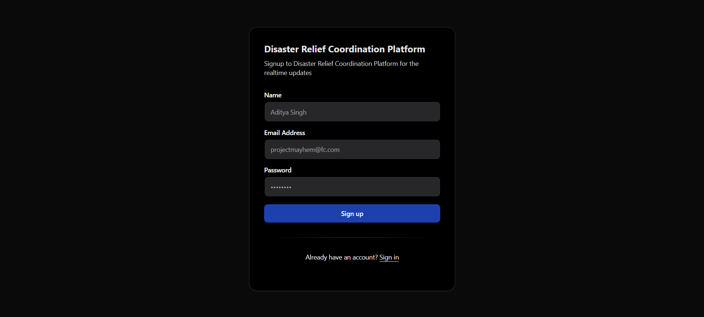
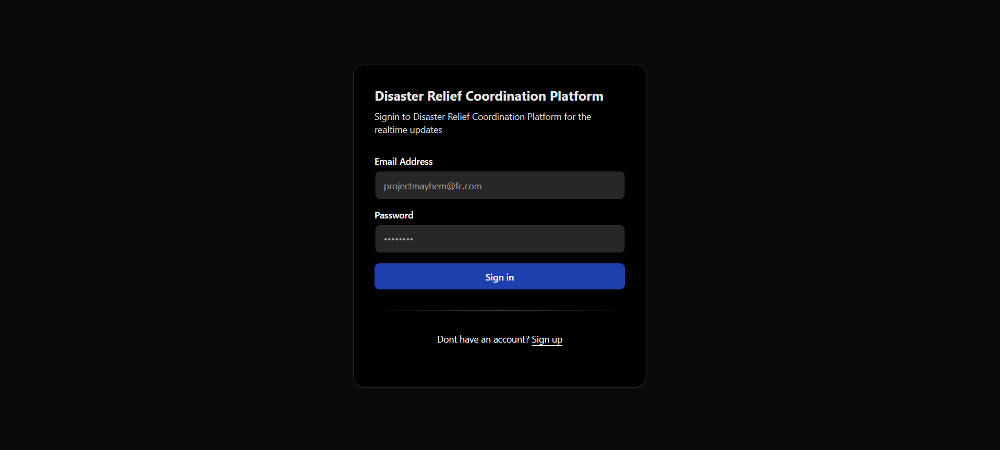
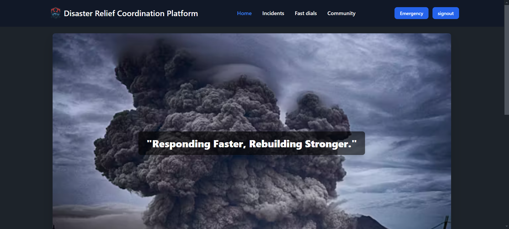
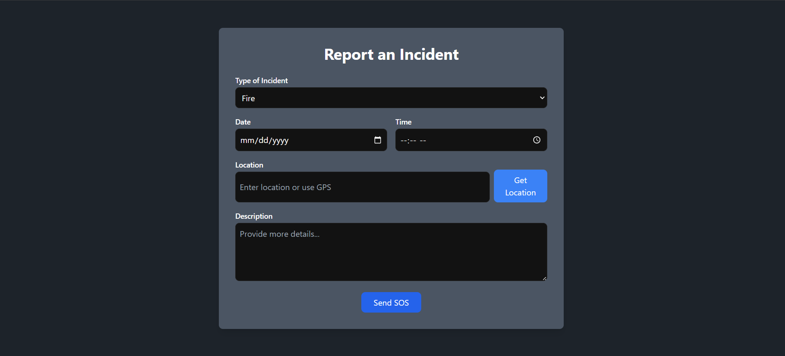
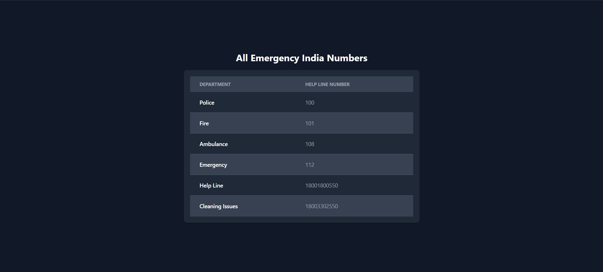
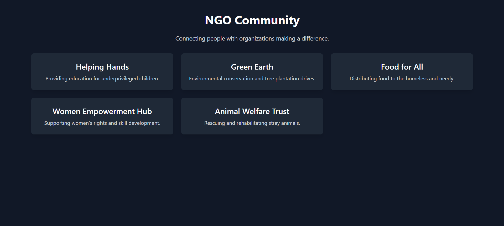

# 🌍 Disaster Management Web App

## 🚀 Overview

This is a **real-time disaster management** web application designed to help users send **SOS alerts**, share their **live location**, **chat in real-time**, and access **emergency resources** during disasters. It also provides **offline support** to ensure functionality even in extreme conditions.

---

## 🎯 Features

### 🔴 SOS Alert System

- Users can send an **SOS alert** with their **real-time location**.
- If offline, the **last known location** is stored and sent when back online.
- Emergency contacts and authorities receive immediate notifications.

### 🗺️ Live Map with Disaster Updates

- **Google Maps API integration** for tracking **affected areas, shelters, and emergency services**.
- Users can **report disasters** (e.g., floods, earthquakes, fires) and mark safe zones.
- Color-coded risk zones (High, Medium, Low risk).

### 💬 Real-Time Chat (WebSockets)

- **Survivors, volunteers, and authorities** can communicate instantly.
- Messages are **stored and sent** when users regain connectivity.

### 📞 Emergency Contacts & Helplines

- Integrated **emergency numbers** (police, fire, hospitals, NGOs, etc.).
- One-click **call & SMS** functionality.

### 📢 AI-Powered Alerts & Warnings

- **Live weather and disaster alerts** fetched via APIs.
- Personalized warnings based on the user’s location.

### 🛠️ First Aid & Survival Guide

- Step-by-step **CPR, injury treatment, and survival tips**.
- Available **offline** for easy access.

### 🏠 Find Shelters & Resources

- **Nearby shelters, food distribution centers, hospitals, and safe zones**.
- Users can **report shortages** and **mark resources as available/unavailable**.

### 👥 Family & Friends Tracking (Companion Mode)

- Users can **share their live location** with trusted contacts.
- If they go offline, their **last known location is visible**.

---

## How to start the Project

- \*\*First start the backend server..
- \*\*go the the backend folder there are wo servers Websocket and Node.js
- \*\*To start the websocketserver node (wsFilename).js
- \*\*To start the Node.js serer follow the same command as ws just change the filename
- \*\*To start the Frontend server
- \*\*Go to the frontend folder
- \*\* type the command npm run dev..

## Images









## 🛠️ Tech Stack

### Frontend:

- **React.js** (User-friendly UI)
- **Tailwind CSS / Bootstrap** (Responsive design)
- **Google Maps API** (Real-time location tracking)

### Backend:

- **Node.js + Express.js** (Server-side functionality)
- **MongoDB / Firebase** (Storing user data, chats, and locations)
- **WebSockets (Socket.io)** (Real-time messaging)

### Other Integrations:

- **Twilio API** (SOS alerts via SMS when offline)
- **PWA (Progressive Web App)** (Works even with weak network)

---

## 🏗️ Installation & Setup

### Prerequisites:

- Node.js & npm installed
- MongoDB (if using a local database)

### Steps:

1. **Clone the repository**
   ```bash
   git clone https://github.com/your-repo/disaster-management.git
   cd disaster-management
   ```
2. **Install dependencies**
   ```bash
   npm install
   ```
3. **Set up environment variables** (Create a `.env` file and add API keys)
   ```env
   GOOGLE_MAPS_API_KEY=your_api_key_here
   TWILIO_ACCOUNT_SID=your_twilio_sid
   TWILIO_AUTH_TOKEN=your_twilio_auth_token
   MONGO_URI=your_mongodb_uri
   ```
4. **Start the server**
   ```bash
   npm run dev
   ```
5. **Access the website** at `http://localhost:3000`

---

## 🔥 Future Enhancements

- ✅ Voice-activated **SOS trigger** (e.g., "Help me!")
- ✅ **Drone/Satellite** integration for disaster tracking
- ✅ **Battery-saving mode** for low-power usage

---

## 🤝 Contributing

Want to contribute? Please fork the repository and submit a pull request. 🚀

---

## 📜 License

This project is **open-source** under the MIT License.

---

## 💡 Need Help?

For any issues or questions, reach out via **[email/contact link]** or create an **issue** on GitHub! 🚀
